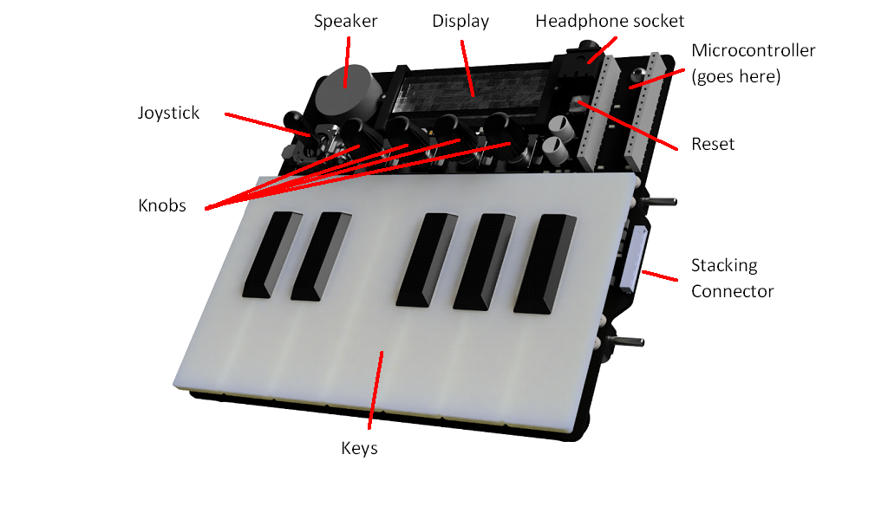
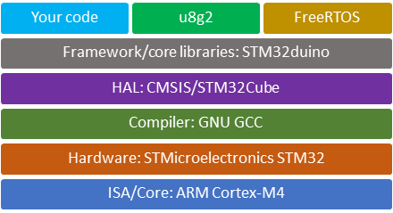
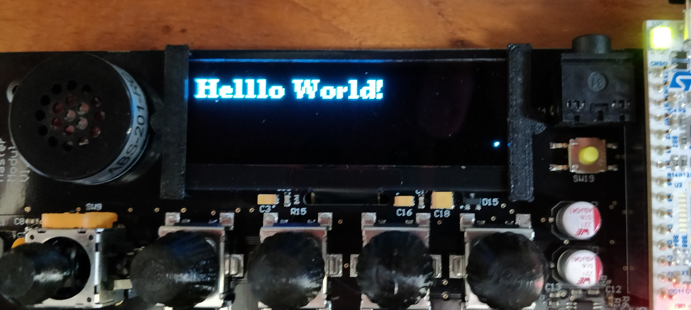
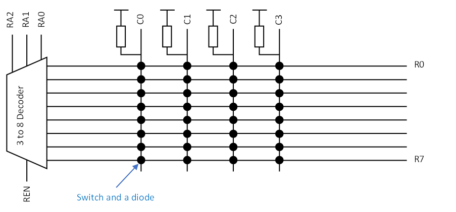
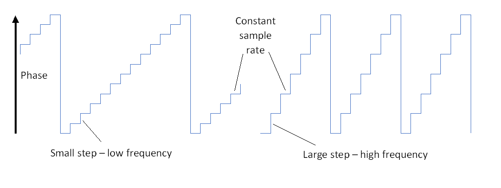
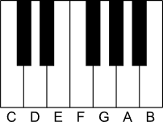
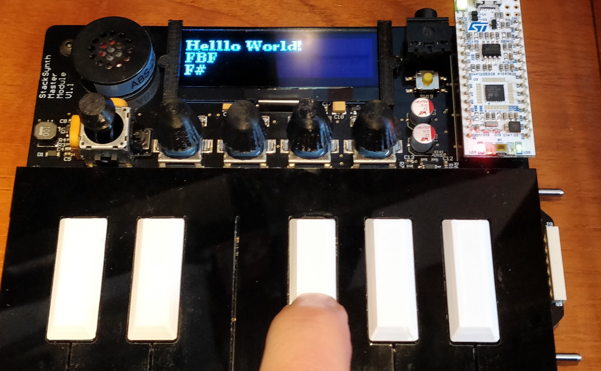

# Embedded Systems
## Coursework 2 Part 1: Real time systems

This coursework is based on a music synthesiser.
You need to write the embedded software to make it work.
Several real time tasks will need to be executed concurrently, such as detecting key presses and generating the output waveform.

The first part of the lab notes will lead you through the implementation of some of the core features of the synthesiser, including:
- Scanning the key matrix to find out which keys are pressed
- Using an interrupt to generate a sawtooth wave
- Using threads to allow the key scan and display tasks to be decoupled and executed concurrently

The inputs to the synthesiser are 12 keys (1 octave), 4 control knobs and a joystick.
The outputs are 2 channels of audio and an OLED display.
There is a serial port for communication with a host via USB, and a CAN bus that allows multiple modules to be stacked together to make a larger keyboard.

The keyboard is controlled using a ST NUCLEO-L432KC microcontroller module that contains a STM32L432KCU6U processor, which has an Arm Cortex-M4 core.



### 1. Load the starter code onto the keyboard

The development flow for the project is based on Platformio, which is an IDE customisation for Visual Studio Code.
Platformio can target many different embedded platforms using different frameworks and libraries.
We will use the STM32duino framework, which provides an Arduino-like environment that makes it easy to access microcontroller hardware features.
The overall development stack looks like this:



Get started by installing Platformio and forking the starter code
1. Install Visual Studio Code, if you don’t have it already, and add Platformio from the website, or by searching for it in the VS Code extensions marketplace
2. Fork the starter code from GitHub. You can use the GitHub extension for VS Code, use git from the command line or any other client, or download the zipped project files from GitHub. Open the project folder in VS Code
3. Switch to the Platformio Home tab with the 🏠 button on the bottom toolbar and select the libraries view. Search for the U8g2 display driver library, select the latest version and add it to the project.
4. (Windows only) Install the [STLINK driver](https://www.st.com/en/development-tools/stsw-link009.html). A copy is available in Teams if you want to avoid creating an account.
5. Connect the microcontroller module on the synth to your computer with a USB cable.
6. Compile and the code and flash it to the MCU using the → button on the bottom toolbar
7. The ‘Hello World’ message should appear on the OLED display.
8. Open the serial monitor using the 🔌 button on the toolbar.
   Press the reset button on the synth (SW19) or the MCU module (B1) and you will see the `Hello World’ message on the terminal
   


> **Note**
> 
> The STM32duino framework is useful because you can use familiar functions to access hardware and get access to useful libraries.
> However, it does not include libraries for all the hardware modules and you may need to edit the framework source code to unlock advanced features, such as DMA and the full DAC resolution.
> 
> STM32duino is built on top of [STM32Cube](https://www.st.com/en/ecosystems/stm32cube.html), which is the manufacturer’s hardware abstraction layer (HAL) for STM32 microcontrollers.
> You can access the HAL in STM32duino just by including the relevant header files, but a few things require edits to the STM32duino files.
> 
> You can also build a project with STM32Cube from scratch.
> You can compile STM32Cube projects in Platformio, but you will probably need to start by generating initialisation code using [STM32CubeMX](https://www.st.com/en/development-tools/stm32cubemx.html), which is a GUI-based tool.
> You can also use [STM32CubeIDE](https://www.st.com/en/development-tools/stm32cubeide.html), which is the manufacturer’s Eclipse-based IDE, as an alternative to VS Code and Platformio.
> 
> The libraries used in these lab instructions are based on STM32duino, so they won’t work with STM32Cube.
> You will need to locate or create ports for libraries, for example by [defining callbacks for U8g2 to access I2C and GPIO hardware](https://github.com/olikraus/u8g2/wiki/Porting-to-new-MCU-platform)

### 2. Read inputs

The keys and knobs on the keyboard module are connected to a key matrix, which allows many keys to be read with a small number of microcontroller pins.



| [RA2,RA1,RA0] | C0 | C1 | C2 | C3 |
| ------------- | -- | -- | -- | -- |
| 0	| Key C	| Key C♯	| Key D	| Key D♯ | 
| 1	| Key E	| Key F	| Key F♯	| Key G | 
| 2	| Key G♯	| Key A	| Key A♯	| Key B | 
| 3	| Knob 3 A	| Knob 3 B	| Knob 2 A	| Knob 2 B | 
| 4	| Knob 1 A	| Knob 1 B	| Knob 0 A	| Knob 0 B | 
| 5	| Knob 2 S	| Knob 3 S	| Joystick S	| West Detect | 
| 6	| Knob 0 S	| Knob 1 S	| Unused	| East Detect | 
| 7	| Unused | Unused | Unused | Unused |

1. Read a single row of the switch matrix
   1. Write a function that will read the inputs from the four columns of the switch matrix (C0, C1, C2, C3) and return the four bits concatenated together as a single byte.

      ```c++
      uint8_t readCols(){
      …
      }
      ```
			
      Add lines to the start of your function to set each row select address (RA0, RA1, RA2) low and the row select enable (REN) high.
			This will drive R0 low and allow you to read Row 0, notes C–D♯.
			Use the function `DigitalWrite()` to set the outputs and `DigitalRead()` to read the inputs.

   2. Modify the main loop of the function to call the `readCols()` function and print the result on the OLED display at coordinates (2,20). 

      ```c++
      uint8_t keys = readCols();
      u8g2.setCursor(2,20);
      u8g2.print(keys,HEX); 
      ```
			
      You will need to replace the existing statement `u8g2.print(count++);`, which prints the iteration count

   3. Upload and test your code.
      Pressing each of the four left-most keys of the keyboard should change the number that is displayed on the screen.
			The keys read as logic 0 when they are pressed so if you press all four of the keys the number will change to 0.

2. Read all the keys
   1. Write a function that will select a given row of the switch matrix by setting the value of each row select address pin.
      Disable (set low) the row select enable before the row select address pins are being changed, then enable it again at the end of the function.
			This prevents glitches as the address pins are changed.

      ```c++
      void setRow(uint8_t rowIdx){
      …
      }
      ```
			
      Remove the lines that control the row select addresses and row select enable from the `readCols()` function.

   2. In the `loop()` function, create an array that will store the reading from each row in the matrix
 
      ```c++
      uint8_t keyArray[7];
      ```

      Place a for loop around your call to `readCols()`.
			This will be the key scanning loop and it should loop over the row numbers 0 to 2.
			For each row, it should set the row select address then read the columns.
			The result should be stored in keyArray using the row number as the array index. 
      
      `keyArray` has seven elements because the key matrix has 7 rows, but we’ll only read rows 0 to 2 for now because that range covers the 12 music keys.

      The switch matrix columns take some time to switch from logic 0 to logic 1 when the row select changes due to parasitic capacitance.
			Add a small delay inside your loop between the calls to `setRow()` and `readCols()`:
			
      ```c++
      delayMicroseconds(3);
      ```
			
   3. Modify the display code to print the contents of keyArray indices 0, 1 and 2.
      Format the data in hexadecimal format so that each row is represented by a single digit on the display.
			Upload the code and you should now see a 3-digit hexadecimal number representing the state of all 12 keys.
			Check that each key press is detected.
			
> **Note**
> 
> The complete assignment of microcontoller pins in the synth module is as follows:
> 
> | Starter code name | STM32duino name | MCU pin | Function |
> | ----------------- | --------------- | ------- | -------- |
> | RA0_PIN | D3 | PB0 | Row select address bit 0 |
> | RA1_PIN | D6 | PB1 | Row select address bit 1 |
> | RA2_PIN | D12 | PB4 | Row select address bit 2 |
> | REN_PIN | A5 | PA6 | Row select enable |
> | C0_PIN | A2 | PA3 | Key matrix column 0 |
> | C1_PIN | D9 | PA8 | Key matrix column 1 |
> | C2_PIN | A6 | PA7 | Key matrix column 2 |
> | C3_PIN | D1 | PA9 | Key matrix column 3 |
> | OUT_PIN | D11 | PB5 | Multiplexed output for display enable and handshaking signals |
> | OUTL_PIN | A4 | PA5 | Analogue audio output left |
> | OUTR_PIN | A3 | PA4 | Analogue audio output right |
> | JOYX_PIN | A0 | PA1 | Analogue joystick input X |
> | JOYY_PIN | A1 | PA0 | Analogue joystick input Y |
> |  | D4 | PB7 | Display I2C SDA |
> |  | D5 | PB6 | Display I2C SCL |
> |  | D10 | PA11 | CAN bus RXD |
> |  | D2 | PA12 | CAN bus TXD |
> | LED_BUILTIN | LED_BUILTIN | PB3 | LED LD3 |

### 3. Generate Sound

The next basic function of the keyboard is to generate sound.
We will begin by generating a sawtooth wave with a frequency according to the key that is pressed.

Most digital systems for generating and processing signals use a constant sample rate: we will use a sample rate $f_\mathrm{s}$ of 22kHz.
A fixed sample rate means that we can change the frequency of the note by changing the number of samples that make up one period of the waveform.



Therefore, we need to convert each note frequency into a step size for a phase accumulator.
Over time, the phase accumulator will count up until it overflows and starts again.
Each overflow of the phase accumulator represents one period of the output waveform.
Increasing the step size causes the phase accumulator to overflow after fewer sample periods and therefore the frequency is higher.

We will use a 32-bit unsigned phase accumulator because that is the word size of the CPU.
That means it will overflow with a modulus of $2^{32}$ and the step size $S$ required to achieve a certain frequency $f$ is given by:

$$S=\frac{2^{32}f}{f_\mathrm{s}}$$

1.	Define an array of the phase step sizes required for each of the 12 notes of your keyboard.
	Since these values will be constants, use a const array initialiser of the form:
		
	```C++
	const uint32_t stepSizes [] = { … };
	```

	You could also use `constexpr` to evaluate the step sizes in your code during compilation.
	
	Configure your keyboard to use equal temperament, which means that the difference in frequency between adjacent notes is a factor of $\sqrt[12]{2}$.
	Therefore, a span of 12 keys results in a doubling of frequency, which is one octave.
	Base your tuning on a frequency of 440Hz for the note A, which is the 10th key from the left of your keyboard and element 9 of your notes array.

	

2.	Add code to your main loop that will check the state of each key in `keyArray` and look up the corresponding step size in the `stepSizes` array if the key is pressed.
	Store the result in a global variable:
	 
	```C++
	volatile uint32_t currentStepSize;
	```
	This variable will be accessed by more than one concurrent task, so it is declared with the keyword `volatile`.
	This instructs the compiler to access the variable in memory each time it appears in the source code.
	Otherwise, the compiled code may keep a copy of the variable in a CPU register and miss updates made by other tasks.
	 
	You will only be able to play one note at once at first, so if multiple keys are pressed just use the step size from the last key to be checked.
	If no keys are pressed then the step size should be set to zero.
	 
	Add information to the OLED display to show which note is selected.

	

3.	Write a new function that will update the phase accumulator and set the analogue output voltage at each sample interval:

	```C++
	void sampleISR() {
	…
	}
	```
	 
	It will be an interrupt service routine, which means that it cannot have arguments or a return value.
	The function will be triggered by an interrupt 22,000 times per second.
	It will add currentStepSize to the phase accumulator to generate the output waveform.
	Define the phase accumulator as a static local variable, so that its value will be stored between successive calls of `sampleISR()`:

	```C++
	static uint32_t phaseAcc = 0;
	phaseAcc += currentStepSize;
	```

	The conversion from the phase accumulator to a sawtooth wave output voltage is quite simple because the value of a sawtooth function is directly proportional to the phase.
	Right-shift (divide by $2^n$) the phase accumlator and subtract $2^7$, to scale the range to $-2^7\leq V_\text{out}\leq2^7-1$:

	```C++
	int32_t Vout = (phaseAcc >> 24) - 128;
	```

	The Arduino `analogWrite()` function has a range of 0-255: 0 produces 0V and 255 produces 3.3V.
	Therefore, you need to add 128 so that the median voltage (DC offset) is 1.65V.

	```C++
	analogWrite(OUTR_PIN, Vout + 128);
	```
	
	You may wonder why 128 is subtracted, then added again.
	In future, you will need to multiply and add signals, for example to implement a volume control or polyphony.
	That will be easier when samples have an offset of zero because the offset will be unaffected by mathematical operations.
	Meanwhile, the phase accumulator itself cannot have a zero offset because that would require a signed integer and the overflow of signed integers results in undefined behaviour in C and C++.
	

	Different waveform functions will require more maths to convert phase into output voltage.
	For example, a sine wave would require the calculation of a sin function.
	Whatever the waveform, it’s best to define the function to have a midpoint of zero and then add the DC offset in the final step.

4.	A timer is needed to trigger the interrupt that will call `sampleISR()`.
	Create a timer in the setup function using the stm32duino library class `HardwareTimer`:

	```C++
	TIM_TypeDef *Instance = TIM1;
	HardwareTimer *sampleTimer = new HardwareTimer(Instance);
	```

	The timer is configured by setting the period, attaching the ISR and starting the timer, also in the setup function:

	```C++
	sampleTimer->setOverflow(22000, HERTZ_FORMAT);
	sampleTimer->attachInterrupt(sampleISR);
	sampleTimer->resume();
	```
	 
	See the [documentation for the timer library](https://github.com/stm32duino/wiki/wiki/HardwareTimer-library) for more information.
	
5.	Test your code.
	You should hear a note from the speaker when you press each key.
	You could test that the notes are correct with a guitar tuner app if you like.
	 
	> **Warning**
	> 
	>  Do not use headphones until you have tested the loudness with the headphones away from your ears.

	> **Note**: Numerically Controlled Oscillator
	> 
	> You may wonder if it was necessary to use a 32-bit phase accumulator if only 8 bits are needed to create the waveform.
	> The technique is known as a numerically controlled oscillator and it allows a more accurate frequency than would be possible with an 8-bit accumulator.
	> The down sampling from the 32-bit accumulator to the 8-bit output means that each individual cycle of the waveform may have an inaccurate period, but that error is averaged out over multiple cycles.
	> The result is phase jitter, which is less obvious than a continuous frequency error.
	> 
	> If you try to generate very high tones you will hear aliased frequency components arising from the periodicity of the jitter, particularly for discontinuous waveforms like the sawtooth.
	> This is a limitation of the 22kHz sample rate.

6.	Even though the code works, there is a possible synchronisation bug.
	The `currentStepSize` variable could be read in `sampleISR()` when it has been partially modified in the main loop.

	The first improvement is to reduce the number of accesses to `currentStepSize` in the main loop to a single store operation.
	You were asked to check each key and update `currentStepSize` if the key is pressed.
	The code can be improved by using a local variable for the step size until all the keys have been checked.
	Then, when the final value is known, the local variable can be copied to `currentStepSize` so that the global variable is only accessed once.

	Next, we can force the write to currentStepSize in the main loop to be an atomic operation using a built-in compiler function.
	The variable is a 32-bit integer so any write is likely to be atomic by default because it can be completed in a single CPU operation.
	However, using an atomic store function makes certain and shows anyone who maintains the code in future that the operation is intended to be atomic:

	```C++
	__atomic_store_n(&currentStepSize, localCurrentStepSize, __ATOMIC_RELAXED);
	```
	 
	This function (actually a compile macro) stores `localCurrentStepSize` in `currentStepSize` as an atomic operation.
	The parameter `__ATOMIC_RELAXED` indicates that we need an atomic store, but we’re not concerned about the ordering of other instructions that don’t use the two variables in question.
	Refer to the documentation for more information about this parameter.

	A complementary call to `__atomic_load_n()` would be necessary if `currentStepSize` was read in another thread.
	However, since the variable is read in an ISR, an atomic operation is unneeded because the ISR cannot be interrupted by anything else that accesses the variable.

	See the [compiler documentation](https://gcc.gnu.org/onlinedocs/gcc/_005f_005fatomic-Builtins.html) for more information about built-in atomic operations.

### 4. Split key scanning and display update tasks with threading

Currently, the keys are read once every execution of the main loop.
The main loop is also used to update the display, which is not ideal because it forces these tasks to have the same initiation interval.
We will separate these two processes into different tasks by creating a thread to run the key scanning task.

1.	Move all your code for scanning the keyboard into a single function:

	```C++
	void scanKeysTask(void * pvParameters) {
	…
	}
	```

  	The function should do the following:
	- Loop through the rows of the key matrix
	- Read the columns of the matrix and store the result in `keyArray`
	- Look up the phase step size for the key that is pressed and update `currentStepSize`

	You will need to make `keyArray` a volatile, global variable so that it can be accessed by both `scanKeysTask()` and the main loop.

	Test your code by calling `scanKeysTask()` in the main loop.
	The parameter `pvParameters` will be used by the thread initialiser — just set it to NULL in your call.
	Everything should work as before.
	 
2.	Install the 'STM32duino FreeRTOS' library with the Platformio library manager.
	Include its header file at the start of your source file:

	```C++
	#include <STM32FreeRTOS.h>
	```
	 
	Now make `scanKeysTask()` an independent thread.
	Convert it to an infinite loop by wrapping contents of the function in a while loop:

	```C++
	while (1) {
	…
	}
	```
	 
	Add the following code into your `setup()` function to initialise and run the thread:

	```C++
	TaskHandle_t scanKeysHandle = NULL;
	xTaskCreate(
	scanKeysTask,		/* Function that implements the task */
	"scanKeys",		/* Text name for the task */
	64,      		/* Stack size in words, not bytes */
	NULL,			/* Parameter passed into the task */
	1,			/* Task priority */
	&scanKeysHandle );  /* Pointer to store the task handle */
	```

	See the [API reference](https://www.freertos.org/a00125.html) for more information about this function call.
	We have used a stack size of 64 words (256 bytes) for the thread.
	The stack needs to be large enough to store all the local variables of the functions called in the thread.

	Add this function call at the end of the setup function to start the RTOS scheduler:

	```C++
	vTaskStartScheduler();
	```

	Remove the call to scanKeysTask() from the main loop.

3.	The thread will need to execute at a constant rate, which will be the sample rate of our keyboard.
	We can use the RTOS function `vTaskDelayUntil()` to do this — it blocks execution until a certain time has passed since the last time the function was completed.

	Declare two local variables in `scanKeysTask()`, before the loop:

	```C++
	const TickType_t xFrequency = 50/portTICK_PERIOD_MS;
	TickType_t xLastWakeTime = xTaskGetTickCount();
	```
	 
	`xFrequency` will be the initiation interval of the task.
	It is given in units of RTOS scheduler ticks and we can use the constant `portTICK_PERIOD_MS` to convert a time in milliseconds to scheduler ticks.
	Here we have set the initiation interval to 50ms.

	`xLastWakeTime` will store the time (tick count) of the last initiation.
	We initialise it with the API call `xTaskGetTickCount()` to get the current time.

	Now you can add the blocking call to `vTaskDelayUntil()` at the start of your infinite loop:

	```C++
	vTaskDelayUntil( &xLastWakeTime, xFrequency );
	```
	 
	This function call blocks execution of the thread until `xFrequency ticks` have happened since the last execution of the loop.
	As an RTOS function, it places the thread into the waiting state and allows the CPU to do other tasks until it is time to run the function again.
	When the required time has passed, `xLastWakeTime` is updated by the RTOS ready for the next iteration.
	See the [API reference](https://www.freertos.org/vtaskdelayuntil.html) for more information about this function call.

4.	Test your code.
	It should behave as before.
	You may have noticed another potential synchronisation bug with the `keyArray` array.
	`keyArray` cannot be treated as a simple atomic variable because it is a multi-word array.
	We will solve the problem in the next section using a mutex.

5.	The main loop is usually left empty in FreeRTOS systems.
	Create another thread to run the display update task (name the function `displayUpdateTask()`) with a 100ms initiation interval.
	Remove the original, polling-based rate control implemented with `if (millis() > next) {…}` and replace it with an infinite loop and a call to `vTaskDelayUntil()`.

	Since 100ms is longer than 50ms, set the priority of the display update thread to 1 and the key scanning thread to 2 (higher priority).
	Use a stack size of 256 words for `displayUpdateTask()`.
	Your `loop()` function should now be empty.

	> **Note**: How much stack?
	> 
	> 
	> The stack stores the arguments, local variables and return pointers for functions that are called.
	> Each thread has its own stack.
	> The total stack required depends on the worst-case combination of function calls.
	> Recursive functions are a bad idea when the stack size is fixed because the worst-case stack requirement depends on the data and it can be hard to determine.
	> 
	> There are two methods to determine the amount of stack to allocate to a thread:
	> 1. Examine the compiler output to find the stack footprint of every function.
	>    Then, add together the combinations of functions that could all be in progress at the same time inside one thread.
	>    The use of libraries makes this process more difficult because they might have their own chains of function calls that are hard to inspect.
	>    The Inspect view in Platformio can be used to explore memory usage in your project.
	> 2. Find it at runtime.
	>    The FreeRTOS function `uxTaskGetStackHighWaterMark()` returns the largest amount of stack that a thread has ever needed.
	>    You can allocate a large stack at first and then optimise when the code is working.
	>    You need to ensure that all the code has been exercised before you report the stack high water mark.
	> 
	> If a thread in your system runs out of stack the RTOS will enter an error state in an infinite loop.
	> The LED on the microcontroller module will flash in bursts of 4 flashes.
	> 
	> You can reduce the stack requirement by using dynamically allocated memory with `new` or `malloc()`.
	> Dynamic memory comes from a single pool (the heap), so it is more flexible than the per-thread allocation of stack memory.

	 
