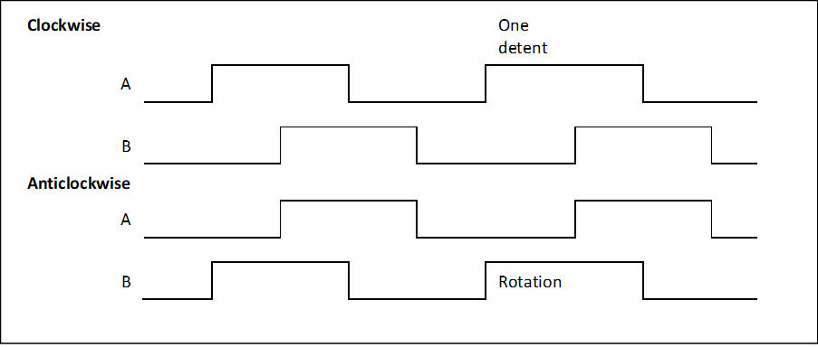

# Embedded Systems
## Coursework 2 Part 1: Real time systems

In the first part of the lab, you wrote code to make the synthesiser play notes with tasks in an interrupt and two threads.
This time we will develop the system further and complete the remaining core goals:
- Use a mutex and queue for thread-safe data sharing
- Decode the knobs and implement a volume control 
- Relay key presses to another keyboard module using the CAN bus
- Measure execution time of a task

### 1. Add a mutex
Part 1 of the lab notes left a synchronisation bug.
The array keyArray is now a global variable and it is accessed by both the main loop and `scanKeysTask()`.
It cannot be accessed atomically because it is an array of multiple bytes — it requires multiple operations to read and write.
Since all the accesses to the array are from threads, not interrupts, it can be protected by a mutex.

1.	Declare a global handle for a FreeRTOS mutex that can be used by different threads to access the mutex object:

	```c++
	SemaphoreHandle_t keyArrayMutex;
	```
	
	FreeRTOS uses the same data structure for semaphores and mutexes, so the handle type and function names overlap.
	The main difference between a semaphore and a mutex is the way they are used.
	A mutex is ‘taken’ (locked) by a thread while it accesses the protected data or resource, then ‘given’ (unlocked) when it is finished.
	All threads that access the resource take then give the mutex in the same way.


	A semaphore is used asymmetrically — one thread tries to take the semaphore, but it is blocked until a different thread gives it.
	A single thread will only take or give a particular semaphore, never both.

	Create the mutex and assign its handle in the setup function, before the scheduler is started:
	
	```c++
	keyArrayMutex = xSemaphoreCreateMutex();
	```
	
	The reference for this function is here: https://www.freertos.org/CreateMutex.html
	
2.	Now you can take the mutex while keyArray is accessed using the appropriate functions:
	
	```c++
	xSemaphoreTake(keyArrayMutex, portMAX_DELAY);
	… //Access keyArray here
	xSemaphoreGive(keyArrayMutex);
	```
	
	Guard accesses to keyArray in both `scanKeysTask()` and `displayUpdateTask()`.
	The parameter `portMAX_DELAY` causes `xSemaphoreTake()` to wait indefinitely for the mutex to become unlocked.
	You can use a finite time, expressed in scheduler ticks, but then you would also need to test if `xSemaphoreTake()` was successful and deal with a failure appropriately. 

3.	Test your code. It should work as before.

	> **Note**: Using mutexes to synchronise arrays
	>
	> You have a choice of how often to lock the mutex while different elements of keyArray are accessed.
	> You could take the mutex separately when every element is read or written.
	> That would mean the array as a whole is not synchronised — the display thread could read part of the array from the latest scan of the key matrix and part from the previous scan.
	> Maybe that wouldn’t be a problem just to display the contents but in other applications this desynchronisation could very bad.
	> 
	> An alternative is to lock the mutex once while the entire array is accessed.
	> However, that means the mutex could be locked for a relatively long time, and task prioritisation could be affected.
	> For example, the key scan loop contains delays to allow the external wiring to settle and the mutex would be locked all this time.
	> 
	> A better approach may be to create local copies of the array in each function that accesses it.
	> You can use the C function `memcpy()` or C++ `std::copy` for this purpose.
	> Then the mutex would only be locked while the copy is taking place, and not the processing.
	> The downside of this method is that extra memory and CPU execution time are required to make the copies.
	> It would be impractical for large arrays.
	> 
	> The correct approach will depend on the application.
	> There will always be complexity when concurrent tasks are required to spend a significant portion of their execution time accessing shared data.

### 2. Knobs

The knobs generate a quadrature signal as they rotate.
We can find the amount of rotation by counting the state changes and we can find the direction of rotation from the ordering of state changes.



The process can be represented as a state transition table.
We can determine if a rotation has happened by comparing the current state to the previous state:

| Previous {B,A} | Current {B,A} | Rotation variable | Note |
| -------------- | ------------- | ----------------- | ---- |
| 00 | 00 |  | No change |
| 00 | 01 | +1 |  | 
| 00 | 10 |  | Intermediate state | 
| 00 | 11 |  | Ignore impossible transition | 
| 01 | 00 | -1 |  | 
| 01 | 01 |  | No change |
| 01 | 10 |  | Ignore impossible transition |
| 01 | 11 |  | Intermediate state |	
| 10 | 00 |  | Intermediate state |
| 10 | 01 |  | Ignore impossible transition |
| 10 | 10 |  |  No change |
| 10 | 11 | -1 |  |	
| 11 | 00 |  | Ignore impossible transition |
| 11 | 01 |  | Intermediate state |	
| 11 | 10 | +1 | |
| 11 | 11 |  | No change |

Note that the rotation variable is only incremented or decremented when input A toggles to give one count per detent of the knob.

1.	Decode knob 3 (the right-hand knob) into a rotation variable by comparing the current state and previous state of the appropriate bits in the key matrix.
	You will need to extend your key matrix scan to include row 3.
	The A and B signals for knob 3 can be read in columns 0 and 1 of row 3.
	The decoding process should happen every time the key matrix is scanned so include it in `scanKeysTask()`.
	
	Store the previous state of the A and B signals in a local variable.
	Assign the current state to the previous state once decoding is complete so that it is ready to use as the previous state in the next iteration. 

	The result of the knob decode is a rotation variable that keeps track of the knob position.
	Create this variable as a global variable so it can be accessed by other threads.
	Add a printout of the variable to your display and check that you can count rotation of the knob.
	
	You can protect access to this variable with `keyArrayMutex` since it will be accessed at the same time as `keyArray`.
	
2.	You will probably notice that the knob decode doesn’t work very well when you turn the knob quickly.
	The problem is the key matrix isn’t scanned quickly enough to detect the transient states, when the inputs {B,A} are briefly at 01 or 10 between detents of the knob.

	One partial solution is to increase the sample rate of the key matrix.
	Try changing the initiation interval of `scanKeysTask()` from 50ms to 20ms.
	That should improve the accuracy but it still won’t be fast enough to capture very fast knob rotation.

3.	Another improvement can be made by making a better effort of interpreting the 'impossible' state transitions, when both A and B change at the same time.
	These transitions are likely to be detected if the intermediate states are missed.
	On their own, an impossible transition does not tell you the direction the knob rotated but you can guess by assuming the direction was the same as the last legal transition, for example:

	| Iteration of `scanKeysTask()` | Previous {B,A} | Current {B,A} | Rotation variable |    |
	| ----------------------------- | -------------- | ------------- | ----------------- | -- |
	| 1 | N/A | 00 |  | No change | 
	| 2 | 00 | 01 | +1 | Normal transition |
	| 3 | 01 | 11 |  | Normal transition |
	| 4 | 11 | 00 | +1 | Missed state, assume same sign as before |

	> **Note**: Knob accuracy
	>
	> It’s not ideal to use a high sample rate to detect the knob movements accurately because it increases CPU utilisation.
	> Normally you would connect incremental encoders directly to MCU pins so you can generate interrupts when the inputs change.
	> Unfortunately, there are not enough pins on the microcontroller module for this.
	> 
	> To avoid this problem, the synthesiser module has an additional microcontroller which can be dedicated to decoding the knobs
	> However, there is not yet a configuration flow that allows you to program this microcontroller.
	> So don’t worry about trying to optimise the knob decode for now — limitations on knob rotation speed will not be penalised in coursework marking. 

4.	The knob can be used to implement a simple volume control.
	First, add limits to your knob decoder so the maximum rotation can be 8 and the minimum can be 0.
	
	Audio volume controls usually adopt a *log taper*, which means the output amplitude varies non-linearly with knob position.
	You can implement a simple log taper by right-shifting (dividing by $2^n$) the output value by an amount proportional to the knob position as it’s calculated in `sampleISR()`:

	```c++
	Vout = Vout >> (8 - knob3Rotation);
	```
	
	If the volume is 8, there is no change to the original value.
	If the volume is reduced to 7, the output value is right-shifted by one and halved.
	If the volume is zero, the right shift by 8 means that the output value is always ±1.
	
	Test the volume control.
	You should find that steps in the volume control are approximately consistent in the perceived loudness.

5.	The mutex `keyArrayMutex`, which you used to protect the variable knob3Rotation, cannot be locked by `sampleISR()` because it is an interrupt.
	Maintain correct data synchronisation by changing the modification to knob3Rotation in `scanKeysTask()` to an atomic access.
	Make sure there is no way the ISR can read a rotation value that’s temporarily outside the permitted bounds, for example if the rotation is incremented then checked against the maximum.

6.	(Advanced) The code will get messy if the knob decoder is replicated for the three other knobs.
	Implement a knob class with methods that allow you to:
	-	Update the rotation value using the latest state of the key matrix
	-	Set upper and lower limits
	-	Read the current rotation value

	Make the class thread safe, meaning that all public methods behave as reenterant functions and they can be called from concurrent tasks without need needing additional synchronisation locks.

