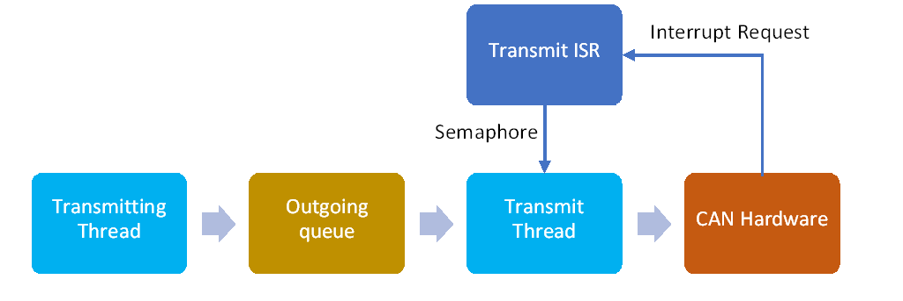

# Embedded Systems
## Coursework 2 Part 1: Real time systems

In the first part of the lab, you wrote code to make the synthesiser play notes with tasks in an interrupt and two threads.
This time we will develop the system further and complete the remaining core goals:
- Use a mutex and queue for thread-safe data sharing
- Decode the knobs and implement a volume control 
- Relay key presses to another keyboard module using the CAN bus
- Measure execution time of a task

### 1. Add a mutex
Part 1 of the lab notes left a synchronisation bug.
The array keyArray is now a global variable and it is accessed by both the main loop and `scanKeysTask()`.
It cannot be accessed atomically because it is an array of multiple bytes — it requires multiple operations to read and write.
Since all the accesses to the array are from threads, not interrupts, it can be protected by a mutex.

1.	Declare a global handle for a FreeRTOS mutex that can be used by different threads to access the mutex object:

	```c++
	SemaphoreHandle_t keyArrayMutex;
	```
	
	FreeRTOS uses the same data structure for semaphores and mutexes, so the handle type and function names overlap.
	The main difference between a semaphore and a mutex is the way they are used.
	A mutex is ‘taken’ (locked) by a thread while it accesses the protected data or resource, then ‘given’ (unlocked) when it is finished.
	All threads that access the resource take then give the mutex in the same way.


	A semaphore is used asymmetrically — one thread tries to take the semaphore, but it is blocked until a different thread gives it.
	A single thread will only take or give a particular semaphore, never both.

	Create the mutex and assign its handle in the setup function, before the scheduler is started:
	
	```c++
	keyArrayMutex = xSemaphoreCreateMutex();
	```
	
	The reference for this function is here: https://www.freertos.org/CreateMutex.html
	
2.	Now you can take the mutex while keyArray is accessed using the appropriate functions:
	
	```c++
	xSemaphoreTake(keyArrayMutex, portMAX_DELAY);
	… //Access keyArray here
	xSemaphoreGive(keyArrayMutex);
	```
	
	Guard accesses to keyArray in both `scanKeysTask()` and `displayUpdateTask()`.
	The parameter `portMAX_DELAY` causes `xSemaphoreTake()` to wait indefinitely for the mutex to become unlocked.
	You can use a finite time, expressed in scheduler ticks, but then you would also need to test if `xSemaphoreTake()` was successful and deal with a failure appropriately. 

3.	Test your code. It should work as before.

	> **Note**: Using mutexes to synchronise arrays
	>
	> You have a choice of how often to lock the mutex while different elements of keyArray are accessed.
	> You could take the mutex separately when every element is read or written.
	> That would mean the array as a whole is not synchronised — the display thread could read part of the array from the latest scan of the key matrix and part from the previous scan.
	> Maybe that wouldn’t be a problem just to display the contents but in other applications this desynchronisation could very bad.
	> 
	> An alternative is to lock the mutex once while the entire array is accessed.
	> However, that means the mutex could be locked for a relatively long time, and task prioritisation could be affected.
	> For example, the key scan loop contains delays to allow the external wiring to settle and the mutex would be locked all this time.
	> 
	> A better approach may be to create local copies of the array in each function that accesses it.
	> You can use the C function `memcpy()` or C++ `std::copy` for this purpose.
	> Then the mutex would only be locked while the copy is taking place, and not the processing.
	> The downside of this method is that extra memory and CPU execution time are required to make the copies.
	> It would be impractical for large arrays.
	> 
	> The correct approach will depend on the application.
	> There will always be complexity when concurrent tasks are required to spend a significant portion of their execution time accessing shared data.

### 2. Knobs

The knobs generate a quadrature signal as they rotate.
We can find the amount of rotation by counting the state changes and we can find the direction of rotation from the ordering of state changes.


The process can be represented as a state transition table.
We can determine if a rotation has happened by comparing the current state to the previous state:

| Previous {B,A} | Current {B,A} | Rotation variable | Note |
| -------------- | ------------- | ----------------- | ---- |
| 00 | 00 |  | No change |
| 00 | 01 | +1 |  | 
| 00 | 10 |  | Intermediate state | 
| 00 | 11 |  | Ignore impossible transition | 
| 01 | 00 | -1 |  | 
| 01 | 01 |  | No change |
| 01 | 10 |  | Ignore impossible transition |
| 01 | 11 |  | Intermediate state |	
| 10 | 00 |  | Intermediate state |
| 10 | 01 |  | Ignore impossible transition |
| 10 | 10 |  |  No change |
| 10 | 11 | -1 |  |	
| 11 | 00 |  | Ignore impossible transition |
| 11 | 01 |  | Intermediate state |	
| 11 | 10 | +1 | |
| 11 | 11 |  | No change |

Note that the rotation variable is only incremented or decremented when input A toggles to give one count per detent of the knob.

1.	Decode knob 3 (the right-hand knob) into a rotation variable by comparing the current state and previous state of the appropriate bits in the key matrix.
	You will need to extend your key matrix scan to include row 3.
	The A and B signals for knob 3 can be read in columns 0 and 1 of row 3.
	The decoding process should happen every time the key matrix is scanned so include it in `scanKeysTask()`.
	
	Store the previous state of the A and B signals in a local variable.
	Assign the current state to the previous state once decoding is complete so that it is ready to use as the previous state in the next iteration. 

	The result of the knob decode is a rotation variable that keeps track of the knob position.
	Create this variable as a global variable so it can be accessed by other threads.
	Add a printout of the variable to your display and check that you can count rotation of the knob.
	
	You can protect access to this variable with `keyArrayMutex` since it will be accessed at the same time as `keyArray`.
	
2.	You will probably notice that the knob decode doesn’t work very well when you turn the knob quickly.
	The problem is the key matrix isn’t scanned quickly enough to detect the transient states, when the inputs {B,A} are briefly at 01 or 10 between detents of the knob.

	One partial solution is to increase the sample rate of the key matrix.
	Try changing the initiation interval of `scanKeysTask()` from 50ms to 20ms.
	That should improve the accuracy but it still won’t be fast enough to capture very fast knob rotation.

3.	Another improvement can be made by making a better effort of interpreting the 'impossible' state transitions, when both A and B change at the same time.
	These transitions are likely to be detected if the intermediate states are missed.
	On their own, an impossible transition does not tell you the direction the knob rotated but you can guess by assuming the direction was the same as the last legal transition, for example:

	| Iteration of `scanKeysTask()` | Previous {B,A} | Current {B,A} | Rotation variable |    |
	| ----------------------------- | -------------- | ------------- | ----------------- | -- |
	| 1 | N/A | 00 |  | No change | 
	| 2 | 00 | 01 | +1 | Normal transition |
	| 3 | 01 | 11 |  | Normal transition |
	| 4 | 11 | 00 | +1 | Missed state, assume same sign as before |

	> **Note**: Knob accuracy
	>
	> It’s not ideal to use a high sample rate to detect the knob movements accurately because it increases CPU utilisation.
	> Normally you would connect incremental encoders directly to MCU pins so you can generate interrupts when the inputs change.
	> Unfortunately, there are not enough pins on the microcontroller module for this.
	> 
	> To avoid this problem, the synthesiser module has an additional microcontroller which can be dedicated to decoding the knobs
	> However, there is not yet a configuration flow that allows you to program this microcontroller.
	> So don’t worry about trying to optimise the knob decode for now — limitations on knob rotation speed will not be penalised in coursework marking. 

4.	The knob can be used to implement a simple volume control.
	First, add limits to your knob decoder so the maximum rotation can be 8 and the minimum can be 0.
	
	Audio volume controls usually adopt a *log taper*, which means the output amplitude varies non-linearly with knob position.
	You can implement a simple log taper by right-shifting (dividing by $2^n$) the output value by an amount proportional to the knob position as it’s calculated in `sampleISR()`:

	```c++
	Vout = Vout >> (8 - knob3Rotation);
	```
	
	If the volume is 8, there is no change to the original value.
	If the volume is reduced to 7, the output value is right-shifted by one and halved.
	If the volume is zero, the right shift by 8 means that the output value is always ±1.
	
	Test the volume control.
	You should find that steps in the volume control are approximately consistent in the perceived loudness.

5.	The mutex `keyArrayMutex`, which you used to protect the variable knob3Rotation, cannot be locked by `sampleISR()` because it is an interrupt.
	Maintain correct data synchronisation by changing the modification to knob3Rotation in `scanKeysTask()` to an atomic access.
	Make sure there is no way the ISR can read a rotation value that’s temporarily outside the permitted bounds, for example if the rotation is incremented then checked against the maximum.

6.	(Advanced) The code will get messy if the knob decoder is replicated for the three other knobs.
	Implement a knob class with methods that allow you to:
	-	Update the rotation value using the latest state of the key matrix
	-	Set upper and lower limits
	-	Read the current rotation value

	Make the class thread safe, meaning that all public methods behave as reenterant functions and they can be called from concurrent tasks without need needing additional synchronisation locks.

### 2. CAN bus communication

The core functions of the keyboard include the ability to send messages to other keyboard modules that indicate when keys are pressed or released.
That way, multiple modules can be stacked together to make a larger keyboard with a single interface and audio output.
The module stacking connectors include a CAN bus for this purpose.

There is no high-level, Arduino-like API for the CAN bus, so the starter code includes a basic library that wraps the relevant HAL module.
Only some of the features of the hardware are exposed by this library.

1.	First, compose the key press message.
	A CAN frame contains up to 8 bytes of data and the starter code library has a fixed frame size of 8 bytes.
	We will define a protocol for messages that notify when a key is pressed or released:

	| Byte | Contents |
	| ---- | -------- |
	| 0 | 0x50: Key pressed (character ‘P’) or 0x52: Key released (character ‘R’) |
	| 1 | Octave number 0-8 |
	| 2 | Note number 0-11 |
	| 3 | Unused |
	| 4 | Unused |
	| 5 | Unused |
	| 6 | Unused |
	| 7 | Unused |
	
	For now, declare a global array that will store an outgoing message
	
	```c++
	volatile uint8_t TX_Message[8] = {0};
	```
	
	Add code to `scanKeysTask()` that will compare the state of each key to the state detected on the previous iteration of the function.
	If a key has changed state, configure `TX_Message` to indicate which note was pressed or released, for example if the note A (key number 9) was pressed and the keyboard was configured to octave 4:
	
	```c++
	TX_Message[0] = 'P';
	TX_Message[1] = 4;
	TX_Message[2] = 9;
	```
	
	Add code to `updateDisplayTask()` that will display the latest message.
	
	```c++
	u8g2.setCursor(66,30);
	u8g2.print((char) TX_Message[0]);
	u8g2.print(TX_Message[1]);
	u8g2.print(TX_Message[2]);
	```
	
	u8g2 uses the Arduino `print()` function, which automatically converts numbers to characters.
	The first byte of the message is already a character code, so it is cast from an integer to type char.
	
	Test that the latest key press or release is shown on the display.
	
2.	Send and Receive with polling

	Begin by using polling loops to control send and receive.
	The STM32duino build of the HAL doesn’t build the CAN module by default, so enable it by opening the file:
	
	```
	~\.platformio\packages\framework-arduinoststm32\cores\arduino\stm32\stm32yyxx_hal_conf.h
	```
	
	and add the line:
	
	```c++
	#define HAL_CAN_MODULE_ENABLED
	```
	
	below the group of similar lines. `~` is your user home directory.
	
	Also include the provided CAN library in your main.cpp:
	
	```c++
	#include <ES_CAN.h>
	```
	
	`scanKeysTask()` includes code that detects a new key press or release and updates `TX_Message`.
	Add the function call that will send the message over the bus using the CAN library:
	
	```c++
	CAN_TX(0x123, TX_Message);
	```
	
	The CAN message ID is fixed as 0x123 for now.
	
	Poll for received messages in `updateDisplayTask()`:
	
	```c++
	while (CAN_CheckRXLevel())
		CAN_RX(ID, RX_Message);
	```
	
	`uint32_t ID` and `uint8_t RX_Message[8]={0}` should be local variables.
	They will store the ID and the data that are received.
	Change the display to show `RX_Message` instead of `TX_Message`.
	`TX_Message` can now become a local variable in `scanKeysTask()`.
	
	The CAN bus needs to be initialised before it will work. Add the following statements to the `setup()` function:
	
	```c++
	CAN_Init(true);
	setCANFilter(0x123,0x7ff);
	CAN_Start();
	```
	
	The `true` argument to `CAN_INIT()` places the CAN hardware in loopback mode, where it will receive and acknowledge its own messages.
	This is helpful for testing because you don’t need to develop on two MCUs simultaneously.
	
	`SetCANFilter()` initialises the reception ID filter.
	Here, it is set up so that only messages with the ID 0x123 will be received.
	The second parameter is the mask, and 0x7ff means that every bit of the ID must match the filter for the message to be accepted.
	
	Test the code.
	It should do the same as before, but now every message you see on the screen is being communicated via the CAN loopback connection.
	
	You can also attach a second keyboard module and see the messages sent from one to the other.
	Change the argument to `CAN_INIT()` to false to disable loopback mode and allow the MCUs to receive each others’ messages.

3.	Implement a receive queue.
	The method of receiving messages is not very good because it uses polling in the display thread.
	Each CAN frame takes less than 1ms to transmit and the hardware can only buffer three messages.
	That means many messages could be missed before the poll statement is reached.
	
	Even a dedicated thread would not be guaranteed to pick up the messages in time so an interrupt is needed to receive every incoming message.
	The interrupt should be very short, so the messages won’t be processed in the ISR, just moved to a larger software buffer.
	A separate decoder task will run as a thread to process the messages on the other side of the queue.
	We will use a thread-safe queue from FreeRTOS, which is designed for passing messages between tasks.

	
	
	First, create a queue handler as a global variable
	
	```c++
	QueueHandle_t msgInQ;
	```

	Initialise it in `setup()`
	
	```c++
	msgInQ = xQueueCreate(36,8);
	```

	The first parameter of the queue is the number of items it can store.
	A larger queue means the message decoding task can have a lower priority since the messages can be allowed to queue up for longer.
	The minimum time to send a CAN frame is around 0.7ms, so a queue length of 36 will take at least 25ms to fill.
	The second parameter is the size of each item in bytes.
	8 bytes is sufficient to store all the data in one CAN frame.
	
	Incoming messages will be written into the queue in an ISR:
	
	```c++
	void CAN_RX_ISR (void) {
		uint8_t RX_Message_ISR[8];
		uint32_t ID;
		CAN_RX(ID, RX_Message_ISR);
		xQueueSendFromISR(msgInQ, RX_Message_ISR, NULL);
	}
	```

	`CAN_RX()` gets the message data, as before, and `xQueueSendFromISR()` places the data in the queue.
	Set the ISR to be called whenever a CAN message is received by passing a pointer to the relevant library function.
	Do this in `setup()`, after `CAN_INIT()` and before `CAN_Start()`.
	
	```c++
	CAN_RegisterRX_ISR(CAN_RX_ISR);
	```

	Create a decode thread with a function `decodeTask` to process messages on the queue.
	The thread will be initiated not by the tick counter, like before, but by the availability of data on the queue:
	
	```c++
	xQueueReceive(msgInQ, RX_Message, portMAX_DELAY);
	```
	
	The call to `xQueueReceive()` will block and yield the CPU to other tasks until a message is available in the queue.
	Place it in the infinite loop in new your decode thread instead of `vTaskDelayUntil()`.
	Nothing else is needed in this thread function for now.
	Remove the call to `CAN_RX()` from the display function and initialise the decode thread in setup.
	
	The call to `xQueueReceive()` is given the `RX_Message` array to hold the result.
	Convert `RX_Message` to a global variable so it can be accessed in both the decode and display tasks.
	This isn’t safe synchronisation because there is no guard against simultaneous access.
	But it will be ok to test with since the only consequence of a collision would be the printing of a partial message, so test it and check that you can still see the message updating with each key press.
	
	Add code to your decode thread to play notes in response to incoming messages. You will need to:
	-	Check the first byte to determine if the message indicates a press or release
	-	For release messages, set the current step size to zero
	-	For press messages, convert the note number to a step size
	-	Multiply the step size by $2^{n-4}$, where $n$ is the octave number.
		For example, if the octave number is 5 then the step size will be doubled to double the frequency.
		Remember that you can use shift operations to multiply by $2^n$.
	-	Update the current step size.
		Remember to use an atomic access to update the `currentStepSize` shared global variable.
		
	If you want to keep the message display on the display, you should protect `RX_Message` with a mutex.
	You can’t lock the mutex while the decode thread blocks on `xQueueReceive()` due to the risk of deadlock, so you’ll need to first place the message in a local array, then copy it to the global array after taking the mutex.
	Use this same mutex to protect access to `RX_Message` when the display is updated.

4.	Add a transmit queue.
	The call to `CAN_TX()` is not ideal either.
	If you look in the library you’ll see that this function polls until there is space in the outgoing mailbox to place the message in.
	So if you send a lot of messages at the same time, `scanKeysTask()` might get stuck waiting for the bus to become available.
	It also not a thread safe function and its behaviour could be undefined if messages are being sent from two different threads.
	
	A queue is useful here too so that messages can be queued up for transmission.
	Multiple threads can place messages on the queue because queue functions are thread-safe.
	
	A new transmit thread is needed to read messages out of the queue and place them in the outgoing mailbox.
	We still want to avoid polling the hardware in the transmit thread, so we can use a semaphore to indicate when a message can be accepted.
	The semaphore will be given by an ISR when there is space in the outgoing mailbox, and taken by the transmit thread before it loads a message.
	The RTOS won’t schedule the thread if the semaphore is unavailable, so CPU cycles will not be wasted by polling.

	
	
	First, create another queue `msgOutQ` for the transmitted messages with a global handle.
	The length of the queue should be 36. Then replace the call to `CAN_TX()` with the RTOS function to place an item on the queue:
	
	```c++
	xQueueSend( msgOutQ, TX_Message, portMAX_DELAY);
	```

	The transmit thread will use a semaphore to check when it can place a message in the outgoing mailbox. Declare a global handler for it:
	
	```c++
	SemaphoreHandle_t CAN_TX_Semaphore;
	```
	
	The STM32 CAN hardware has three mailbox slots for outgoing messages.
	The semaphore will guard access to this resource and, since three messages can be loaded at once, a counting semaphore can be used.
	The semaphore can be initialised with the value three, and this means it can be taken three times by the transmit thread.
	On the fourth attempt, the thread will be blocked until a semaphore is released by the ISR.
	Initialise the semaphore in `setup()`:
	
	```c++
	CAN_TX_Semaphore = xSemaphoreCreateCounting(3,3);
	```

	The maximum count of the semaphore is also three, so it can’t accumulate a count greater than the number of mailboxes.

	Create the transmit thread and initialise it as usual.
	Its infinite loop will have two blocking statements because it must obtain a message from the queue and take the semaphore before sending the message:
	
	```c++
	void CAN_TX_Task (void * pvParameters) {
		uint8_t msgOut[8];
		while (1) {
		xQueueReceive(msgOutQ, msgOut, portMAX_DELAY);
			xSemaphoreTake(CAN_TX_Semaphore, portMAX_DELAY);
			CAN_TX(0x123, msgOut);
		}
	}
	```
	
	Finally, create the ISR which will give the semaphore each time a mailbox becomes available:
	
	```c++
	void CAN_TX_ISR (void) {
		xSemaphoreGiveFromISR(CAN_TX_Semaphore, NULL);
	}
	```

	Register it in the `setup()` in the same way as the receive ISR:
	
	```c++
	CAN_RegisterISR_TX(CAN_TX_ISR);
	```

	Check that your messages are still transmitted.

	> **Note**: Initiation intervals of the communication tasks
	>
	> The message send task waits for data in a queue, not a fixed time interval, so what is its initiation interval for analysis purposes?
	> We need to look at how often items are being placed on the queue, which happens in `scanKeysTask()`.
	> `scanKeysTask()` runs every 20ms and, in the worst case, 12 messages can be generated each time.
	> 
	> To process 12 messages in 20ms, `CAN_TX_Task()` must complete one iteration every 1.67ms, on average.
	> But 1.67ms is a very short initiation interval for a threaded task and it requires a high priority.
	> In fact, this analysis is unnecessarily harsh — the task doesn’t need to process a message every 1.67ms because they are buffered by the queue.
	> A queue of length 36 would fill up in $1.67\times 36=60\text{ms}$ and the task needs to initiate at least once in this time so it can loop through all the queued messages.
	> So the correct initiation interval is 60ms for 36 executions, not 1.67ms for 1 execution.
	> 
	> The decode task is also governed by a 36-item queue.
	> The minimum transmission time of the CAN frames is 0.7ms so, in the worst case, the queue could fill in 25.2ms.
	> That means the analysis for this task should be based on 36 executions with an initiation interval of 25.2ms.

5.	Synthesiser modules should be configurable as senders or receivers.
	Senders will send messages when keys are pressed or released, but they will not generate sound themselves.
	Receivers will not send messages, but they will play notes that are generated from other modules as well as their local keys.
	
	Add a configuration option to define a module as a sender or a receiver.
	It is easiest to do this with preprocessor directives (e.g. `#ifdef`), but it may be more user friendly to allow the mode to be changed at runtime.
	You could also support auto-configuration with the handshake signals to define roles in a multi-module keyboard.
	There should also be a method of choosing the octave number of a module.
	
### 3. Measuring execution time

A critical instant analysis of the system requires us to know the execution time of every task.
On a desktop system a profiling tool could help us, but accurate figures require library and operating system support.
Here we will adopt a more manual method because we need to ensure that we find the worst-case execution time of each task independently.
	
1.	To measure the execution time of a single task, the other tasks need to be disabled.
	In your code, add preprocessor directives that will allow you to disable thread creation. For example:
	
	```c++
	#ifndef DISABLE_THREADS
		xTaskCreate(scanKeysTask,"scanKeys",64,NULL,1,&scanKeysHandle);
		…
	#endif
	```
	
	Also add directives to deactivate the statements that attach ISRs.
	
2.	Each task should be configured for testing under its worst-case execution time.
	For example, to test `scankeys()`, modify the function so that a key press message is generated for each of the 12 keys on every iteration of the function, regardless of which keys are actually pressed.
	
	Add further switches to make the contents of the `while (1)` loop run only once and skip the call to `vTaskDelayUntil()`, so the task does not block.
	Apply other measures to allow tasks to run multiple times without blocking.
	For example, increase the size of `msgOutQ` to 384 so that `scankeystask()` can run 32 times (generating 12 messages per iteration) without blocking.
	
3.	Measure execution time over a fixed number of iterations to average out measurement inaccuracy.
	Place a for loop at the end of the setup function that will call the task-under-test 32 times.
	The for loop can be timed using the Arduino `micros()` function, which returns the number of microseconds since startup.
	Before the for loop, store the value returned from `micros()` into a local variable.
	After the for loop, call `micros()` again and subtract the first value to find the difference.
	Send the difference over the serial port.
	For example:
	
	```c++
	#ifdef TEST_SCANKEYS
		uint32_t startTime = micros();
		for (int iter = 0; iter < 32; iter++) {
			scanKeysTask()
		}
		Serial.println(micros()-startTime);
		while(1);
	#endif
	```
	
	Run the code again and you should see the execution time for 32 iterations of `scanKeysTask()` displayed on the serial terminal.
	It will probably be in the range 50-100µs per iteration.
	
	Devise methods to test every task in your system, including ISRs.
	Use preprocessor directives to make all the test setup reversible.
	Then you will be able to easily switch between a normal build and a test build so you can remeasure execution times if you make any changes.

	> **Note**: FreeRTOS Run Time Statistics
	>
	> [FreeRTOS can provide some information on execution time and utilisation](https://www.freertos.org/rtos-run-time-stats.html) without the need to isolate tasks, but some setting up is required.
	> You need edit `FreeRTOSConfig.h` in the FreeRTOS library to define a macro that accesses the timer in your system.
	> You could use the Arduino `micros()` function or you could set up a new `HardwareTimer` instance to give more precision.
	> 
	> When your system is running, you can call `vTaskGetRunTimeStats()` to get a task utilisation report from the FreeRTOS kernel.
	> The report is placed into a char array that can be written directly to the serial port.
	> 
	> `vTaskGetRunTimeStats()` gives a breakdown of accumulated execution time per task.
	> To covert this into a task execution time per iteration you also need to count the number of iterations of each task.
	> This could be done by adding a counter to each task, but be aware that the numbers could change between calling `vTaskGetRunTimeStats()` and reading the task iteration counters.
	> 
	> Just like the manual method, you need to ensure that execution time measurements are the worst case to use them in a critical instant analysis.
	> That may be challenging to achieve with every task executing at once, but it could be easier to run subsets of the tasks together rather than each one separately.
	> FreeRTOS cannot tell you how much time is spent executing tasks in interrupts.

4.	Execution times should be used in conjunction with initiation intervals to complete a critical instant analysis of your system.
	Refer to the lectures for details.

> **Note**: Next Steps
> 
> These lab instructions have worked through the implementation of the coursework core features using real-time programming techniques that allow concurrent task execution and thread-safe data sharing.
> 
> The advanced features of the coursework are open-ended, so look for new features and improvements to the core features that take your work in an interesting direction.
> The lecture slides for Coursework 2 have some suggestions.
> Whatever you decide to implement, make sure that your system will have correct and reliable real time behaviour – and prove this through analysis in your report.

