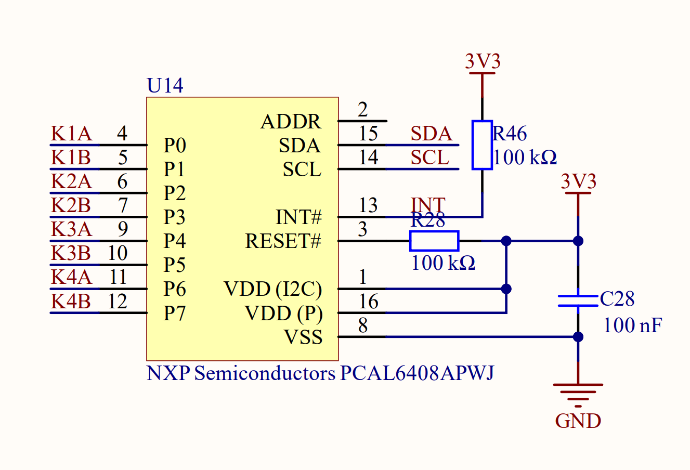

# Improved Knob Input on StackSynth V2
Version 2 of of the StackSynth module includes a I<sup>2</sup>C GPIO expander device: [PCAL6408A](https://www.nxp.com/docs/en/data-sheet/PCAL6408A.pdf). It connects directly to the quadrature (A/B) pins of all four knobs so that a change can be detected instantly - the original method is to read the knob outputs by scanning the key matrix, which has a limited sample rate.


*Excerpt from [StackSynth V2 schematic](StackSynth-v2.pdf) showing PCAL6408A*

## Knob Mode
The StackSynth module has a net `KNOB_MODE` for selecting whether the knobs should be read via the key matrix or the PCAL6408A. `KNOB_MODE` is driven by a register that is set in the same way as other general control signals: the value of `OUT` (microcontroller pin D11/PB5) is latched when a certain key matrix row (row R2 in this case) is activated. The starter code sets `OUT` high, so `KNOB_MODE` is high by default, just like the other general controls (OLED enable, OLED power, handshake outputs).

Setting `KNOB_MODE` high connects the knobs to the key matrix, which means the knob outputs can only be read when the correct row (R3 or R4) is activated. The purpose of this enhancement is to detect knob changes instantly, so `KNOB_MODE` must be set low. This continuously activates rows R3 and R4 by driving the row lines low and disconnects the knob outputs from the column lines so that the other rows in the matrix can be scanned as normal.

To set `KNOB_MODE` low, `OUT` must be set low whenever row R2 is activated in the key matrix scanning loop. However, you cannot set `OUT` low continuously, because that would disable the OLED when rows R3 or R4 are selected.

## Configuring the PCAL6408A
The PCAL6408A is configured and the inputs are read via I<sup>2</sup>C. The bus address is 0x21 and it implements an internal register file. You can use the [Arduino Wire library](https://docs.arduino.cc/language-reference/en/functions/communication/wire/) to communicate via I<sup>2</sup>C. You need to set the configuration registers so that all pins are inputs with pull-up resistors enabled. For example, to enable pull-up resistors you would use the following code:

```c++
Wire.beginTransmission(0x21);
Wire.write(0x43);             // Select pullup enable register
Wire.write(0xff);             // Enable all pullups
Wire.endTransmission();
```
Refer to the [PCAL6408A datasheet](https://www.nxp.com/docs/en/data-sheet/PCAL6408A.pdf) to find the addresses and functions of the registers.

## Reading the knob state
The 8 PCAL6408A inputs are the 8 output pins of the 4 knobs. You can read them all by reading register 0x00:

```c++
Wire.beginTransmission(0x21);
Wire.write(0x00);                   // Select input register
Wire.endTransmission();
Wire.requestFrom(0x21,(uint8_t)1);  // Read 1 byte
while (Wire.available())
    PCALData = Wire.read();         // Load data from the software buffer
```

Do this in the display update thread to make sure you are not accessing the I<sup>2</sup>C interface at the same time as the display library.

## The Complicated Bit
So far, using the PCAL6408A in this way does not offer much benefit - you have just replaced reading two rows of the key matrix with a more complicated set of calls to the I<sup>2</sup>C library. Furthermore, since the I<sup>2</sup>C bus is only accessible when the display library isn't using it, the sample rate is much slower than it was before.

### I<sup>2</sup>C Multi-threading

The Arduino I<sup>2</sup>C library and the underlying HAL functions are not thread-safe, which means that there will be undefined behaviour if I<sup>2</sup>C functions are called from multiple concurrent tasks. This is a classic resource-sharing problem and the most common solutions would be:

1. Guard accesses to the I<sup>2</sup>C bus with a mutex, or
2. Put I<sup>2</sup>C transaction requests on a queue and create a I<sup>2</sup>C driver thread to pull from the queue and perform the I<sup>2</sup>C library calls. This method is used in the lab notes for CAN bus transmission.

The problem is that the existing I<sup>2</sup>C accesses are built in to the u8g2 OLED library, and it would be difficult to modify this to change the method of accessing I<sup>2</sup>C. The mutex is the simpler option because a mutex can guard the call `u8g2.sendBuffer()` (where the I<sup>2</sup>C calls for the OLED take place), plus the block of code for reading the PCAL6408A inputs above. Create a mutex in the global context and wrap these lines in the appropriate calls `to xSemaphoreTake()` and `xSemaphoreGive()`. Now the code for reading the PCAL6408A can be moved to a thread with a more appropriate initiation interval, such as the key matrix scanner.

### Using an interrupt

We still haven't improved the sample rate for reading the knobs. Polling the PCAL6408A more frequently would use more CPU cycles so a better method is to use the interrupt on change feature. The PCAL6408A can be configured to set a dedicated interrupt wire high whenever an input has changed state since it was last read. This signal will trigger an interrupt in the CPU and, in turn, an I<sup>2</sup>C read to find out which knob signals changed. So the PCAL6408A will be read responsively instead of continuously.

In the PCAL6408A configuration, enable the input latch for all inputs. This feature holds the state of a changed pin, so if it changes for just a short time the interrupt will stay active instead of deasserting again. Using the latch prevents bouncing switch contacts from overwhelming the CPU with rapid interrupts. Also enable interrupts for all pins by setting all the bits of the interrupt mask register to zero.

Create a new ISR to respond to the change in knob state. The ISR cannot access the I<sup>2</sup>C bus directly because it cannot lock the mutex, so instead have the ISR set a semaphore or similar. The semaphore will, in turn, unblock a thread that will perform the read. In setup, attach the ISR function (`intISR` here) to the interrupt pin:

```c++
attachInterrupt(digitalPinToInterrupt(PA10), intISR, LOW);
```

Now create a new thread that will await the semaphore, lock the I<sup>2</sup>C mutex, read the inputs from the PCAL6408A, then unlock the mutex. It would be sensible to also do the knob decoding in this thread, since the rotation state of the knobs will change only when the knob inputs are read. Note that the semaphore is taken before the mutex - waiting for the semaphore with the mutex already locked would risk deadlock because it turns the mutex into a blocking dependency.

### Improving performance

Unfortunately, the solution so far will still not deliver good knob performance. The reason is the call to `u8g2.sendBuffer()` takes a long time, and if a knob change occurs during the call, the knob update thread won't be able to proceed until the function is complete and the mutex is released, even if the knob update thread has higher priority.

`u8g2.sendBuffer()` contains many separate I<sup>2</sup>C transactions, plus some delays, so it is possible to preempt this function and allow the knob read to take place when it is partially complete. However, some library modification is inevitible. My solution was to fork the Arduino `Wire` library and insert mutex locks and unlocks at appropriate points.

Bear in mind that the Wire library uses an internal buffer to set up data for transmission, and that must be protected by the mutex as well as the calls to the underlying HAL functions. Simply adding mutex guards to the start and end of each library function will not protect the buffer from being corrupted by another thread. The entire transaction should be protected, starting with the call to `Wire.beginTransmission()` and ending with `Wire.endTransmission()`. Protection of the read buffer is also a consideration, though u8g2 does not perform any I<sup>2</sup>C reads so it is not essential in this application.

With a modified Wire library, u8g2 can be quite simply modified to include your fork instead of the original. Alternatively, the mutex guards could go in u8g2 instead of Wire, but that library is more complex due to its support for different communication methods. You would also need to declare a mutex object in a suitable scope such that it can be accessed by both u8g2 and main.cpp.